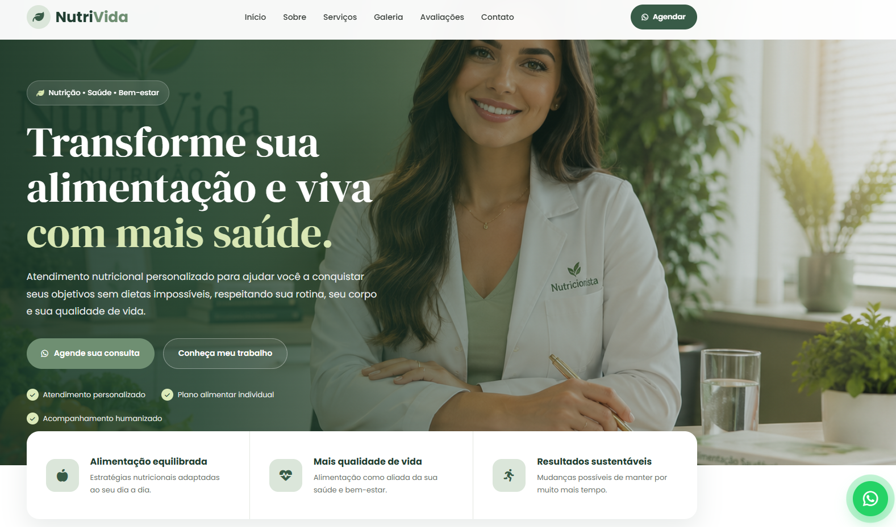

## 👨‍💻 Autor

Desenvolvido por **Riolly Mikael**.

- **GitHub:** [@riollymikael](https://github.com/riollymikael)

---


# 🥗 Landing Page — Nutricionista | NutriVida

Uma landing page moderna, elegante e totalmente responsiva desenvolvida para nutricionistas e profissionais da área de nutrição e bem-estar.

O projeto apresenta uma identidade visual profissional em tons de **verde sálvia, verde escuro, bege e creme**, transmitindo saúde, equilíbrio, naturalidade e qualidade de vida.

A página conta com apresentação profissional da nutricionista, serviços, processo de acompanhamento, galeria com imagens personalizadas, avaliações de pacientes, integração com redes sociais e chamadas estratégicas para agendamento através do WhatsApp.

<div align="center">

  <!-- IMAGEM DE PREVIEW -->
  

  <br><br>

  <!-- BOTÃO DE LIVE DEMO -->
  <p align="center">
    <a href="https://riollymikael.github.io/landing-nutricionista/">
      
    </a>
  </p>

  <!-- BOTÕES DE ACESSO RÁPIDO -->
  <a href="https://riollymikael.github.io/landing-nutricionista/">
    
  </a>

  

</div>

---

## 🚀 Funcionalidades

- **Menu Navegável & Fixo (`Sticky Header`):** acompanha a rolagem da página e permite navegação rápida entre as principais seções.

- **Menu Mobile Responsivo:** menu hambúrguer interativo desenvolvido especialmente para celulares e tablets.

- **Seção Hero:** apresentação principal da NutriVida com imagem profissional, chamada de impacto e botão direto para agendamento pelo WhatsApp.

- **Benefícios em Destaque:** apresentação rápida dos principais pilares do acompanhamento nutricional, como alimentação equilibrada, qualidade de vida e resultados sustentáveis.

- **Apresentação da Nutricionista:** seção profissional com foto, nome, registro CRN, experiência e principais diferenciais do atendimento.

- **Cards de Serviços:** apresentação organizada dos principais serviços oferecidos, incluindo:
  - Emagrecimento
  - Nutrição Esportiva
  - Reeducação Alimentar
  - Saúde e Bem-estar
  - Nutrição Materna
  - Nutrição Familiar

- **Etapas do Acompanhamento:** seção explicativa mostrando como funciona o processo nutricional em 4 etapas:
  1. Conversa inicial
  2. Avaliação
  3. Plano alimentar
  4. Acompanhamento

- **Galeria Profissional:** galeria composta por 7 imagens personalizadas relacionadas ao atendimento nutricional:
  - Consultório
  - Atendimento
  - Avaliação Nutricional
  - Alimentação Saudável
  - Plano Personalizado
  - Avaliação Corporal
  - Saúde & Qualidade de Vida

- **Seção de Avaliações:** depoimentos de pacientes apresentados através de cards com estrelas e comentários.

- **Call to Action (CTA):** área estratégica incentivando o visitante a entrar em contato e iniciar o acompanhamento nutricional.

- **Integração com WhatsApp:** botões distribuídos pela página direcionando o visitante diretamente para o atendimento.

- **Integração com Instagram:** acesso à rede social através do rodapé.

- **Rodapé Completo:** informações de contato, horários, navegação, Instagram, WhatsApp e identificação do desenvolvedor.

- **Botão Flutuante do WhatsApp:** botão fixo com animação de pulso para aumentar a visibilidade e facilitar novos agendamentos.

- **Design Totalmente Responsivo:** interface adaptada para computadores, notebooks, tablets e smartphones.

---

## 🎨 Identidade Visual

A identidade visual da landing page foi desenvolvida especialmente para transmitir os conceitos de:

- 🌿 Saúde
- 🥗 Alimentação saudável
- 💚 Bem-estar
- 🌱 Naturalidade
- ⚖️ Equilíbrio
- ✨ Qualidade de vida

A paleta utiliza principalmente:

- **Verde sálvia**
- **Verde escuro**
- **Bege**
- **Creme**
- **Branco**
- **Detalhes dourados**

O resultado é uma interface leve, sofisticada e profissional, adequada para clínicas e profissionais da área de nutrição.

---

## 🛠️ Tecnologias Utilizadas

- **HTML5:** estrutura semântica da landing page.

- **CSS3:** estilização completa utilizando variáveis CSS, Flexbox, CSS Grid, media queries, transições e animações.

- **JavaScript (ES6):** controle do menu responsivo, comportamento do header e interações da interface.

- **Font Awesome:** biblioteca utilizada para ícones de WhatsApp, Instagram, serviços e elementos da interface.

- **Google Fonts:** utilização das fontes **Poppins** e **DM Serif Display** para criar contraste entre textos modernos e títulos sofisticados.

- **GitHub Pages:** hospedagem e publicação da landing page.

---

## 📱 Responsividade

A landing page foi desenvolvida para funcionar corretamente em diferentes tamanhos de tela.

### 💻 Desktop

Layout completo com múltiplas colunas, galeria dinâmica e navegação horizontal.

### 📱 Tablet

Elementos reorganizados automaticamente para aproveitar melhor o espaço disponível.

### 📲 Smartphone

Layout adaptado para telas pequenas, incluindo:

- Menu hambúrguer
- Botões maiores para toque
- Hero responsivo
- Cards em coluna
- Galeria reorganizada
- Textos redimensionados
- CTA adaptado
- Rodapé responsivo
- Botão flutuante do WhatsApp

---

## 🖼️ Galeria

A página utiliza imagens personalizadas para manter uma identidade visual consistente em todas as seções.

As imagens seguem o mesmo padrão visual da **NutriVida**, utilizando ambientes modernos, iluminação natural, elementos em madeira, plantas e tons de verde.

| Imagem | Utilização |
|---|---|
| `hero-nutricionista.jpg` | Imagem principal do Hero |
| `nutricionista.jpg` | Foto profissional da nutricionista |
| `galeria-1.jpg` | Consultório |
| `galeria-2.jpg` | Atendimento |
| `galeria-3.jpg` | Avaliação Nutricional |
| `galeria-4.jpg` | Alimentação Saudável |
| `galeria-5.jpg` | Plano Personalizado |
| `galeria-6.jpg` | Avaliação Corporal |
| `galeria-7.jpg` | Saúde & Qualidade de Vida |

---

## 📂 Estrutura do Projeto

```text
landing-nutricionista/
│
├── index.html
│   └── Estrutura principal da landing page
│
├── style.css
│   └── Estilos, animações e responsividade
│
├── script.js
│   └── Menu mobile e interações da página
│
├── README.md
│   └── Documentação do projeto
│
└── assets/
    │
    ├── preview.png
    │   └── Prévia do projeto para o README
    │
    ├── hero-nutricionista.jpg
    │   └── Imagem principal do Hero
    │
    ├── nutricionista.jpg
    │   └── Foto profissional da nutricionista
    │
    ├── galeria-1.jpg
    │   └── Consultório
    │
    ├── galeria-2.jpg
    │   └── Atendimento
    │
    ├── galeria-3.jpg
    │   └── Avaliação Nutricional
    │
    ├── galeria-4.jpg
    │   └── Alimentação Saudável
    │
    ├── galeria-5.jpg
    │   └── Plano Personalizado
    │
    ├── galeria-6.jpg
    │   └── Avaliação Corporal
    │
    └── galeria-7.jpg
        └── Saúde & Qualidade de Vida
```

---

## 🌐 Demonstração Online

A landing page está publicada através do GitHub Pages:

### 🚀 [Acessar Landing Page NutriVida](https://riollymikael.github.io/landing-nutricionista/)


---

## 💡 Objetivo do Projeto

Este projeto foi desenvolvido com o objetivo de criar uma landing page profissional para nutricionistas, oferecendo uma apresentação moderna dos serviços e facilitando a conversão de visitantes em novos pacientes.

A estrutura pode ser personalizada para diferentes profissionais, consultórios e clínicas de nutrição, alterando informações como:

- Nome da nutricionista
- CRN
- Serviços
- Telefone
- WhatsApp
- Instagram
- Endereço
- Horários
- Avaliações
- Imagens
- Cores
- Textos

---

## 🔗 Links

- 🌐 **Site:** [NutriVida - Landing Page](https://riollymikael.github.io/landing-nutricionista/)
- 💻 **GitHub:** [@riollymikael](https://github.com/riollymikael)

---


## 📄 Licença

Este projeto foi desenvolvido para fins de portfólio, estudo e demonstração de desenvolvimento Front-End.

---

⭐ Se você gostou do projeto, considere deixar uma estrela no repositório!
